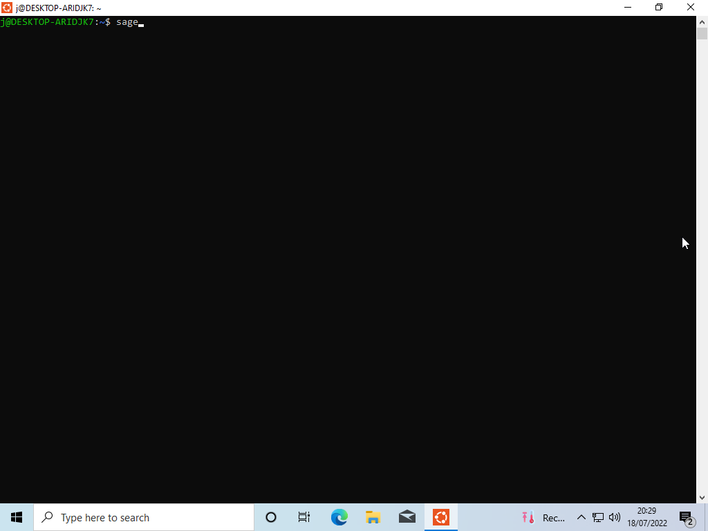

# Installing Sagemath for great good
This document is meant to provide some brief instructions on how to install Sagemath on your device in preparation for the lattice labs.
Please note that it's impossible for us to cover all possible combinations of operating systems and hardware: as a result, we only attempt to cover
the most common cases here. If you have a combination that isn't covered in this document, feel free to reach out to us: we will try our best to help.


## Sagemath on Linux
Sagemath is provided by the package managers of most Linux distributions. Thus, installing Sagemath is normally as simple as typing something like this in your terminal:

```bash
sudo apt-get install sagemath # On Debian or Ubuntu
```

Depending on your operating system you'll likely need to substitute the call to ```apt-get install``` with the specific syntax for your package manager: you'll likely know the
syntax far better than we do.

## Sagemath on Macos.
Sagemath can be installed on Macos in a few ways. Here we will focus on two: using [Brew](https://brew.sh/), and using [Conda](https://docs.conda.io/en/latest/).
We recommend using Brew, as it is slightly easier to use compared to Conda.

### Using Brew
[Brew](https://brew.sh/) is a package manager for Macos. It's a commonly used piece of software that makes it easy to install software on a Mac.
To install Brew, click one of the [links](https://brew.sh/) to Brew and copy the command in the "Install Homebrew" textbox into your terminal.

Once Brew has been installed, you can install Sagemath by typing ```brew install --cask sage``` into your terminal. This may take a while.

After this, you should be able to launch Sagemath by typing ```sage``` into your terminal.

### Using Conda
If you don't use Brew as a package manager, then a nice way to install Sagemath is to use [Conda](https://docs.conda.io/en/latest/). Conda is another package manager for MacOS, but Conda
can also be used on Windows and Linux too. For the sake of this tutorial, we'll use Miniconda, which is a variant of Conda.

To install Conda:
1. Click on [this](https://github.com/conda-forge/miniforge#miniforge3) link and download the right script for your architecture. If your Mac is a new M1 mac, then click on the "arm64" link.
   Otherwise, click on the "x86_64" link.
2. Open your terminal and navigate to your Downloads folder (e.g by typing ```cd ~/Downloads```).
3. You may need to mark the script as executable. To do this, type ```chmod +x <name of the script that was downloaded>```.
4. Install this script by typing ```./<name of the script that was downloaded>```. It's OK to accept all of the default options.
5. Close your terminal and re-open it. When your terminal re-opens, your prompt should start with a ```(base)```.

   
To install Sagemath:
1. Type ```conda create -n sage```. Accept the packages that Conda wants to install.
2. Type ```conda install -c conda-forge sage```. Again, accept the packages that Conda wants to install.
3. Once the installation has finished, type ```conda activate sage```. You will need to do this each time you want to use Sagemath.
4. Finally, to use sagemath, type ```sage```. 


## Sagemath on Windows
Installing Sage on Windows can be a little bit tricky. This is because certain functionalities that Sage depends on aren't necessarily available on Windows.
The recommended way of getting around this is to use the [Windows Subsystem for Linux](https://docs.microsoft.com/en-us/windows/wsl/about).

### Step 1: Installing WSL
Windows 10 and 11 have the "Windows Subsystem for Linux" (WSL), which essentially installs a Linux virtual machine inside your Windows operating system. This makes it really easy to install Linux packages inside your Windows 
installation.

#### Part 0: Enabling virtual machines 
You may need to enable virtualisation in your BIOS / UEFI. This is rather variable across machines, and as a result it is not possible for us to cover this step here. Instead, we recommend that you look up how to do this for your particular machine.

#### Part 1: Enabling WSL

To enable WSL, first navigate to Settings.


Then click on the "Update and Security" icon at the bottom of the page:


After, click on "For developers":


And finally click on "developer mode":


If this is already ticked, then this means that developer mode is already enabled. You can go to Part 2.

As part of this, Windows may ask if you _really_ want to enable developer mode. Click "Yes".


#### Part 2: Turning on WSL

Open Powershell as an administrator (by right clicking and selecting "Run as an Administrator"). 


Copy and paste the following command into Powershell:

```Enable-WindowsOptionalFeature -Online -FeatureName Microsoft-Windows-Subsystem-Linux```.


Windows may ask you to restart at this point. Type "Y" and let your computer restart. 

#### Part 3: Installing Linux

With this done, we can now install a Linux distribution. There's a few to choose from, but for this
tutorial we'll choose Ubuntu. 

To install Ubuntu, first open the Microsoft store:


Then, search for "Ubuntu":


Now, install Ubuntu by clicking on the "Ubuntu" icon and clicking "Install". You do not need to select a particular version.


Windows may ask if you want to sign-in to a Microsoft account if you haven't already. If you haven't, then you don't need to. 

Once your download has finished, type "Ubuntu" into your search bar and click on the top result. This will finish installing Ubuntu on your device.


You should get a prompt that asks you to enter a new "Unix username". You can set whatever you want here. It should also prompt you for a password.


The whole process looks like this:


Congratulations! You've now installed Ubuntu and WSL.

#### What if it doesn't prompt me for a password?

Don't worry! You can change the password manually.

To do this, open Powershell again (this time it doesn't need to be as an administrator) and:

- Type ```wsl -u root passwd <username>```, where ```<username>``` is the username of your current user.
- This will prompt you to change the password. Make sure you remember this password.
- Type ```exit```.

This looks like this:


### Step 2: Installing Sagemath.

You can now use Ubuntu. If you didn't have to manually set the password, then Ubuntu should already be open for you. Otherwise, you can launch it by typing "Ubuntu" into your search bar and clicking on the top icon as before.

Before you do anything, you'll need to update Ubuntu. To do this, type:

```sudo apt-get update```


You can now install sagemath by typing:

```
sudo apt-get install sagemath
```


This should then go and install sagemath for you. You can test this by typing ```sage``` in Ubuntu. 



If your installation was successful, then you terminal should look something like this:


